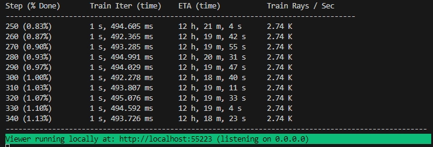

# 3d-viewer
repository for adding papr model to the nerfstudio codebase. The original papr model can be found here: https://zvict.github.io/papr/

## File Structure
Our file structure is shown below:

```
├── method_papr
|   ├── configs
│   ├── dataset
|   ├── models
│   ├── __init__.py
│   ├── papr_config.py
│   ├── papr_pipeline.py 
│   ├── papr_model.py 
│   ├── papr_field.py 
│   ├── papr_datamanger.py 
├── pyproject.toml
```

## Registering with Nerfstudio
### Prerequisites

You must have an NVIDIA video card with CUDA installed on the system. Make sure that your python version is 3.10
### Create environment

To create environmrnt with python virtual environment
```
virtualenv --no-download py310
source py310/bin/activate
pip install --upgrade pip
```
Then make sure to clone the nerfstudio github repo [here](https://github.com/nerfstudio-project/nerfstudio/).

Then do as following to install nerfstudio
```
cd nerfstudio
pip install --upgrade pip setuptools
pip install -e .
```
Since our code applied tiny-cuda-nn, so make sure that tiny-cuda-nn is correctly installed as below
```
pip install git+https://github.com/NVlabs/tiny-cuda-nn/#subdirectory=bindings/torch
```
After that, with environment activated, you can install the papr model with following commands
```
source py310/bin/activate
cd 3d-viewer/
pip install -e .
ns-install-cli
```
## Training your first model!

The following will train a _papr_ model.

```bash
# Download some test data:
ns-download-data nerfstudio --capture-name=kitchen
# Train model
ns-train papr --data data/nerfstudio/kitchen
```

If everything works, you should see training progress like the following:

<p align="center">
    
</p>

Navigating to the link at the end of the terminal will load the webviewer. If you are running on a remote machine, you will need to port forward the websocket port (defaults to 7007).
Follow the nerfstudio instructions on how to port forward the websocket port:
https://docs.nerf.studio/quickstart/viewer_quickstart.html
